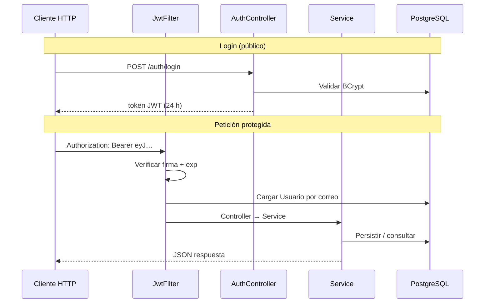

# Style Factory — Backend

API REST en **Java 17 + Spring Boot** para la gestión integral de **Style Factory**, salón de belleza y bienestar (proyecto final **Full-Stack Java**, Generation Colombia). Expone endpoints para autenticación, usuarios, empleados (estilistas), servicios, horarios y reservas, con seguridad basada en **JWT**, control de acceso por roles y persistencia en **PostgreSQL** (Supabase en producción).

---

## Enlaces del proyecto

| Recurso | URL |
|---------|-----|
| **API en producción (Render)** | https://stylefactoryapi.onrender.com |
| **Swagger UI** | https://stylefactoryapi.onrender.com/swagger-ui/index.html |
| **Health check** | https://stylefactoryapi.onrender.com/health |
| **Repositorio backend** | https://github.com/EnithV/stylefactory-backend |
| **Frontend (GitHub Pages)** | https://enithv.github.io/stylefactory/ |
| **Repositorio frontend** | https://github.com/EnithV/stylefactory |

---

## Stack tecnológico

| Tecnología | Versión / detalle |
|------------|-------------------|
| Java | 17 |
| Spring Boot | 4.0.6 |
| Spring Web MVC | REST JSON |
| Spring Data JPA | Hibernate |
| Spring Security | JWT stateless |
| PostgreSQL | Supabase (producción) |
| JWT | jjwt 0.12.6 |
| OpenAPI / Swagger | springdoc-openapi 3.0.0 |
| Validación | Jakarta Bean Validation |
| Pruebas | JUnit 5 + Mockito |
| Build | Maven |

---

## Arquitectura

El proyecto sigue una arquitectura en capas clásica de Spring Boot:

```
Cliente (GitHub Pages / navegador)
        │
        ▼ HTTP + JSON (+ Authorization: Bearer …)
┌───────────────────────────────────────┐
│  Controllers  (/auth, /usuarios, …)   │
├───────────────────────────────────────┤
│  Services     (reglas de negocio)     │
├───────────────────────────────────────┤
│  Repositories (Spring Data JPA)       │
├───────────────────────────────────────┤
│  PostgreSQL (Supabase)                │
└───────────────────────────────────────┘
        ▲
        │ JwtFilter valida token antes del controller
        │ SecurityConfig define rutas públicas y roles
```

### Estructura de paquetes

```
src/main/java/com/backend/styleFactory/
├── StyleFactoryApplication.java      # Punto de entrada
├── auth/
│   ├── AuthController.java             # POST /auth/register, /auth/login
│   ├── LoginRequestDTO.java
│   └── RegisterRequestDTO.java
├── config/
│   ├── ApplicationConfig.java          # AuthenticationManager, PasswordEncoder
│   ├── CorsConfig.java                 # Orígenes GitHub Pages + localhost
│   ├── SecurityConfig.java             # Cadenas de filtros JWT + Swagger
│   └── SwaggerConfig.java              # Esquema bearerAuth (OpenAPI)
├── controller/
│   ├── EmpleadoController.java
│   ├── HealthController.java           # GET /, /health
│   ├── HorarioController.java
│   ├── ReservaController.java
│   ├── ServicioController.java
│   └── UsuarioController.java
├── DTO/                                # Request/Response por entidad
├── exception/
│   └── GlobalExceptionHandler.java
├── model/
│   ├── Empleado.java
│   ├── Horario.java
│   ├── Reserva.java
│   ├── RolUsuario.java                 # ADMIN | EMPLEADO | CLIENTE
│   ├── Servicio.java
│   └── Usuario.java                    # Implementa UserDetails
├── repository/                         # JpaRepository por entidad
├── security/
│   ├── JwtFilter.java                  # Extrae Bearer token del header
│   └── JwtUtil.java                    # Generación y validación JWT
└── service/                            # Lógica de negocio

src/main/resources/
└── application.properties              # NO se versiona (ver .gitignore)

src/test/java/.../service/
└── ReservaServiceTest.java
```

---

## Configuración local

### Requisitos

- JDK 17+
- Maven 3.8+
- PostgreSQL local **o** proyecto Supabase con credenciales de conexión

### Variables y propiedades

El archivo `src/main/resources/application.properties` está en **`.gitignore`**. Cada desarrollador debe crearlo localmente con este contenido de referencia:

```properties
server.port=8081
spring.application.name=styleFactory

# Base de datos
spring.datasource.url=jdbc:postgresql://HOST:5432/postgres
spring.datasource.username=TU_USUARIO
spring.datasource.password=TU_CONTRASEÑA
spring.datasource.driver-class-name=org.postgresql.Driver

# JPA / Hibernate
spring.jpa.hibernate.ddl-auto=update
spring.jpa.show-sql=true
spring.jpa.properties.hibernate.format_sql=true
spring.jpa.open-in-view=false

# JWT (valores de desarrollo; en Render se sobreescriben por entorno)
jwt.secret=TU_CLAVE_SECRETA_LARGA
jwt.expiration=86400000

# Swagger
springdoc.api-docs.path=/v3/api-docs
springdoc.swagger-ui.path=/swagger-ui
springdoc.swagger-ui.enabled=true
springdoc.api-docs.enabled=true
```

| Propiedad | Descripción |
|-----------|-------------|
| `server.port` | Puerto local por defecto **8081**. Render inyecta `PORT` (8080). |
| `spring.jpa.hibernate.ddl-auto` | **`update`** en producción para no borrar datos. En local puedes usar `create` solo si quieres recrear tablas. |
| `jwt.secret` | Clave HMAC para firmar tokens. **Nunca** commitear valores reales. |
| `jwt.expiration` | Duración del access token en ms. **86400000 = 24 horas**. |

### Ejecutar la aplicación

```bash
git clone https://github.com/EnithV/stylefactory-backend.git
cd stylefactory-backend
mvn spring-boot:run
```

Alternativa: ejecutar la clase `StyleFactoryApplication` desde el IDE.

- API local: `http://localhost:8081`
- Swagger local: `http://localhost:8081/swagger-ui/index.html`

### Datos iniciales (Supabase)

Scripts SQL de referencia en el repositorio del **frontend** (`dataBase/`):

| Archivo | Propósito |
|---------|-----------|
| `query_base_de_datos.sql` | Esquema inicial de tablas |
| `seed_catalogo_stylefactory.sql` | 6 estilistas + 10 servicios alineados con el frontend |
| `migracion_imagenes_locales.sql` | URLs Cloudinary → GitHub Pages en empleados y servicios |
| `migracion_duracion_servicios.sql` | Columna `duracion_minutos` en servicios |

Ejecutar en **Supabase → SQL Editor** del proyecto vinculado a Render (`SPRING_DATASOURCE_*`).

---

## Despliegue en Render

### Servicio web

1. Conectar el repositorio `EnithV/stylefactory-backend`.
2. Build: `mvn clean package -DskipTests` (o el comando configurado en Render).
3. Start: `java -jar target/styleFactory-0.0.1-SNAPSHOT.jar`.

### Variables de entorno obligatorias

| Variable | Descripción |
|----------|-------------|
| `SPRING_DATASOURCE_URL` | JDBC Supabase (pooler recomendado), ej. `jdbc:postgresql://…pooler.supabase.com:6543/postgres` |
| `SPRING_DATASOURCE_USERNAME` | Usuario de conexión Supabase |
| `SPRING_DATASOURCE_PASSWORD` | Contraseña de la base de datos |
| `JWT_SECRET` | Clave secreta para firmar JWT (hex o string largo) |
| `JWT_EXPIRATION` | `86400000` (24 h) u otro valor en milisegundos |
| `PORT` | Lo asigna Render automáticamente |

> **Importante:** Si cambias `JWT_SECRET` en producción, todos los tokens emitidos con la clave anterior dejan de ser válidos. Los usuarios deben volver a iniciar sesión.

### Cold start (plan gratuito)

Tras inactividad, la primera petición puede tardar **30–90 segundos** mientras el contenedor arranca. El frontend muestra mensajes de conexión acordes en `config.js`.

---

## Seguridad

### Modelo JWT stateless

- El token **no se guarda** en PostgreSQL.
- Se genera en `POST /auth/login` y expira según `jwt.expiration`.
- El cliente lo envía en cada petición protegida: `Authorization: Bearer <token>`.
- `JwtFilter` valida firma y expiración; carga el `Usuario` desde la BD por correo (subject del token).

### Roles (`RolUsuario`)

| Rol | Uso principal |
|-----|----------------|
| `ADMIN` | Panel de administración del frontend; acceso completo a la API autenticada |
| `EMPLEADO` | Estilistas; acceso a rutas `/empleados/**` (excepto catálogo público) |
| `CLIENTE` | Registro, reservas, área «Mis reservas» |

Spring Security antepone `ROLE_` al evaluar autoridades (`hasRole("ADMIN")` ↔ `ROLE_ADMIN`).

### Rutas públicas (sin JWT)

| Método | Ruta | Notas |
|--------|------|-------|
| GET | `/`, `/health` | Estado del servicio |
| POST | `/auth/register`, `/auth/login` | Autenticación |
| GET | `/servicios`, `/servicios/{id}` | Catálogo público para el sitio |
| GET | `/empleados/catalogo` | Estilistas activos para reservas |
| GET | `/horarios` | Disponibilidad (flujo de reservas en frontend) |
| GET | `/reservas/ocupadas` | Franjas ya reservadas por estilista y fecha |
| GET | `/swagger-ui/**`, `/v3/api-docs/**` | Documentación OpenAPI |
| OPTIONS | `/**` | Preflight CORS |

Todo lo demás requiere JWT válido. Rutas `/empleados/**` (CRUD) exigen `ADMIN` o `EMPLEADO`. La ruta `/admin/**` está reservada para `ADMIN` (sin controladores propios aún).

### CORS

`CorsConfig.java` permite:

- `https://enithv.github.io` (GitHub Pages — el header `Origin` no incluye `/stylefactory`)
- `http://localhost:*` y `http://127.0.0.1:*`

Métodos permitidos: `GET`, `POST`, `PUT`, `PATCH`, `DELETE`, `OPTIONS`.

### Crear usuario administrador

El registro público (`POST /auth/register`) asigna siempre rol `CLIENTE`; el campo `rol` del cuerpo se ignora.

Para crear un administrador: insertar en Supabase con rol `ADMIN`, o usar `POST /usuarios` con JWT de un admin existente.

**Swagger:** `POST /auth/login` → copiar `token` → botón **Authorize** → pegar solo el token (sin `Bearer`).

---

## API REST — referencia completa

**Base URL producción:** `https://stylefactoryapi.onrender.com`  
**Base URL local:** `http://localhost:8081`

### Auth

| Método | Ruta | Auth | Descripción |
|--------|------|------|-------------|
| POST | `/auth/register` | Público | Alta de usuario. Rol por defecto: `CLIENTE`. |
| POST | `/auth/login` | Público | Devuelve JWT + datos del usuario. |

**Login — cuerpo:**

```json
{
  "correo": "cliente@ejemplo.com",
  "contrasena": "MiPassword123!"
}
```

**Login — respuesta exitosa:**

```json
{
  "token": "eyJhbGciOiJIUzI1NiJ9…",
  "id": 1,
  "correo": "cliente@ejemplo.com",
  "rol": "CLIENTE",
  "nombre": "María López"
}
```

**Registro — cuerpo:**

```json
{
  "nombre": "María López",
  "correo": "cliente@ejemplo.com",
  "telefono": "3001234567",
  "contrasena": "MiPassword123!",
  "rol": "CLIENTE"
}
```

### Usuarios (`/usuarios`)

| Método | Ruta | Auth | Descripción |
|--------|------|------|-------------|
| POST | `/usuarios` | JWT | Crear usuario |
| GET | `/usuarios` | JWT | Listar |
| GET | `/usuarios/{id}` | JWT | Obtener por ID |
| PUT | `/usuarios/{id}` | JWT | Actualizar. Si **no** se envía `contrasena`, se conserva la actual |
| DELETE | `/usuarios/{id}` | JWT | Desactivar (`estado = false`) |

### Empleados (`/empleados`)

| Método | Ruta | Auth | Descripción |
|--------|------|------|-------------|
| GET | `/empleados/catalogo` | **Público** | Lista reducida para el flujo de reservas |
| GET | `/empleados` | ADMIN/EMP | Listar todos |
| GET | `/empleados/{id}` | ADMIN/EMP | Detalle |
| POST | `/empleados` | ADMIN/EMP | Crear (asociado a `Usuario`) |
| PUT | `/empleados/{id}` | ADMIN/EMP | Actualizar |
| DELETE | `/empleados/{id}` | ADMIN/EMP | Desactivar (borrado lógico) |

### Servicios (`/servicios`)

| Método | Ruta | Auth | Descripción |
|--------|------|------|-------------|
| GET | `/servicios` | **Público** | Catálogo activo |
| GET | `/servicios/{id}` | **Público** | Detalle |
| POST | `/servicios` | JWT | Crear (panel admin) |
| PUT | `/servicios/{id}` | JWT | Actualizar |
| DELETE | `/servicios/{id}` | JWT | Eliminar |

Campos relevantes del servicio: `nombre`, `descripcion`, `urlImagen`, `precio`, `tipoServicio`, `duracionMinutos` (15–480), `estado`.

### Horarios (`/horarios`)

| Método | Ruta | Auth | Descripción |
|--------|------|------|-------------|
| GET | `/horarios` | **Público** | Listar (usado por el flujo de reservas) |
| GET | `/reservas/ocupadas` | **Público** | Franjas ocupadas por empleado y fecha (`?empleadoId=&fecha=`) |
| POST | `/horarios` | **ADMIN** | Crear o guardar (panel admin empleados) |

### Reservas (`/reservas`)

| Método | Ruta | Auth | Descripción |
|--------|------|------|-------------|
| GET | `/reservas` | JWT | Listar todas (admin) |
| GET | `/reservas/mis-reservas` | JWT | Reservas del usuario autenticado |
| GET | `/reservas/{id}` | JWT | Detalle |
| POST | `/reservas` | JWT | Crear reserva |
| PUT | `/reservas/{id}` | JWT | Actualizar (revalida horario) |
| PATCH | `/reservas/{id}/estado` | JWT | Cambiar solo estado (panel admin) |
| DELETE | `/reservas/{id}` | JWT | Eliminar |

**Crear reserva — cuerpo:**

```json
{
  "fecha": "2026-06-15",
  "hora": "10:00:00",
  "estado": "CONFIRMADA",
  "usuarioId": 2,
  "empleadoId": 1,
  "servicioId": 3
}
```

**PATCH estado — cuerpo:**

```json
{
  "estado": "COMPLETADA"
}
```

Estados válidos: `PENDIENTE`, `CONFIRMADA`, `CANCELADA`, `COMPLETADA`.

**Respuesta de reserva (ejemplo):**

```json
{
  "id": 10,
  "fecha": "2026-06-15",
  "hora": "10:00:00",
  "estado": "CONFIRMADA",
  "nombreUsuario": "María López",
  "nombreEmpleado": "Ana García",
  "nombreServicio": "Tinte y Coloración"
}
```

### Reglas de negocio — horarios de reserva

Implementadas en `ReservaService.validarReglasHorario()` (zona `America/Bogota`):

| Regla | Valor |
|-------|-------|
| Apertura del salón | 9:00 a.m. |
| Última hora de **inicio** de cita | 6:00 p.m. |
| Cierre de atención | 8:00 p.m. |
| Duración | `duracionMinutos` del servicio |
| Fechas pasadas | Rechazadas |
| Hoy, hora ya pasada | Rechazada |
| Fin del servicio después de 8 p.m. | Rechazada |

`updateEstado()` **no** revalida horario: permite al admin gestionar el ciclo de vida sin mover fecha/hora.

### Health

| Método | Ruta | Respuesta |
|--------|------|-----------|
| GET | `/` | JSON con enlaces a Swagger y frontend |
| GET | `/health` | `{"estado":"ok"}` |

---

## Modelo de datos (resumen)

| Tabla | Entidad | Notas |
|-------|---------|-------|
| `usuarios` | `Usuario` | PK `id_usuario`, correo único, contraseña BCrypt |
| `empleados` | `Empleado` | FK a usuario; borrado lógico (`estado`) |
| `servicios` | `Servicio` | Incluye `duracion_minutos` y `tipo` |
| `horarios` | `Horario` | Disponibilidad por empleado/fecha |
| `reservas` | `Reserva` | FK usuario, empleado, servicio; `estado` como String |

Relaciones principales:

```
Usuario 1 —— 0..1 Empleado
Usuario 1 —— * Reserva
Empleado 1 —— * Reserva
Servicio 1 —— * Reserva
```

---

## Manejo de errores

`GlobalExceptionHandler` devuelve JSON uniforme:

```json
{
  "timestamp": "2026-05-30T14:22:00",
  "status": 400,
  "error": "Bad Request",
  "message": "La última hora de inicio permitida es las 6:00 p.m."
}
```

- Errores de negocio (`RuntimeException` en services): **400**
- Validación de DTOs (`@Valid`): **400** con primer campo inválido
- Sin autenticación / token inválido: **401**
- Sin permiso de rol: **403**

---

## Swagger / OpenAPI

1. Abrir https://stylefactoryapi.onrender.com/swagger-ui/index.html
2. Ejecutar `POST /auth/login` con credenciales válidas.
3. Copiar el campo `token` de la respuesta.
4. Clic en **Authorize** → pegar el token (sin prefijo `Bearer`).
5. Probar endpoints protegidos (`GET /usuarios`, `GET /reservas`, etc.).

`SwaggerConfig` registra el esquema `bearerAuth` (HTTP Bearer, formato JWT). Las rutas públicas de auth y catálogo usan `@SecurityRequirements` vacío donde aplica.

---

## Pruebas unitarias

Ubicación: `src/test/java/com/backend/styleFactory/service/ReservaServiceTest.java`

| Test | Verifica |
|------|----------|
| `save_DeberiaCrearReserva_CuandoEntidadesExisten` | Creación exitosa |
| `save_DeberiaLanzarExcepcion_CuandoUsuarioNoExiste` | Usuario inexistente |
| `save_DeberiaLanzarExcepcion_CuandoServicioExcedeCierreAtencion` | Regla 8 p.m. |
| `save_DeberiaCrearReserva_CuandoDuracionCabeEnHorarioAtencion` | Inicio 6 p.m. + 120 min OK |

```bash
mvn test
```

---

## Integración con el frontend

El frontend (`EnithV/stylefactory`) consume esta API mediante:

- `assets/js/config.js` — `API_BASE`, rutas GitHub Pages, normalización de imágenes
- `assets/js/apiClient.js` — CRUD servicios/reservas (módulos ES6)
- `assets/js/sfAlert.js` — feedback en admin y formularios
- Autenticación — `POST /auth/login`, `POST /auth/register`
- Perfil cliente — `GET/PUT /usuarios/{id}`, `GET /reservas/mis-reservas`
- Catálogo — `GET /servicios` (público)
- Reservas — `GET /empleados/catalogo`, `GET /horarios`, `POST /reservas`
- Panel admin — CRUD servicios, reservas (`PATCH …/estado`), empleados y horarios

Las imágenes del catálogo se sirven desde GitHub Pages (`urlImagen` en BD); no hay subida a Cloudinary en el flujo actual.

Diagrama de flujo de autenticación:



---

## Borrado lógico

- **Usuario** y **Empleado:** `DELETE` pone `estado = false`. No se eliminan filas para preservar historial de reservas.
- **Reserva** y **Servicio:** eliminación física vía repository.

---

## Estado del proyecto

| Funcionalidad | Estado |
|---------------|--------|
| CRUD Usuario, Empleado, Servicio, Horario, Reserva | Completo |
| JWT + roles + CORS GitHub Pages | Completo |
| Catálogo, empleados y horarios públicos (GET) | Completo |
| Reglas de horario con duración | Completo |
| PATCH estado reservas (admin y cancelación cliente) | Completo |
| Anti doble reserva + slots ocupados públicos | Completo |
| POST reserva con usuarioId del JWT | Completo |
| Registro público solo CLIENTE | Completo |
| Endpoints admin restringidos por rol | Completo |
| GET mis-reservas + PUT perfil sin reenviar contraseña | Completo |
| Swagger con Authorize JWT | Completo |
| Despliegue Render + Supabase | Operativo |
| Pruebas unitarias ReservaService | 4 tests |

### Mejoras futuras (no implementadas)

- Endpoint `GET /admin/metricas` con agregaciones en servidor.
- Refresh tokens y revocación de sesiones.
- Envío de correos (confirmación de reserva/registro).
- Endpoints bajo `/admin/**` dedicados.
- Ampliar cobertura de tests.

---

## Solución de problemas

| Síntoma | Causa probable | Acción |
|---------|----------------|--------|
| 403 en Swagger con token | Token expirado o no Authorize | Volver a login y Authorize |
| 403 desde GitHub Pages en PATCH | CORS sin PATCH (versiones antiguas) | Desplegar commit con `PATCH` en `CorsConfig` |
| 401 en panel admin | Token ausente en `localStorage` | Re-login en el sitio |
| NetworkError / timeout | Cold start Render | Esperar ~1 min y reintentar |
| Error JDBC al arrancar | Variables `SPRING_DATASOURCE_*` incorrectas | Revisar Render Environment |
| Tokens invalidados tras deploy | Cambió `JWT_SECRET` | Login de nuevo |

---

*Style Factory — Cortes que inspiran.*  
Proyecto **Generation Colombia**. Frontend: [EnithV/stylefactory](https://github.com/EnithV/stylefactory).
